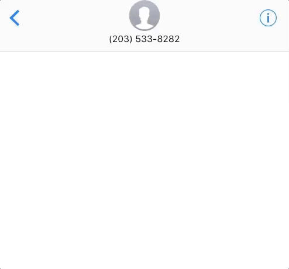
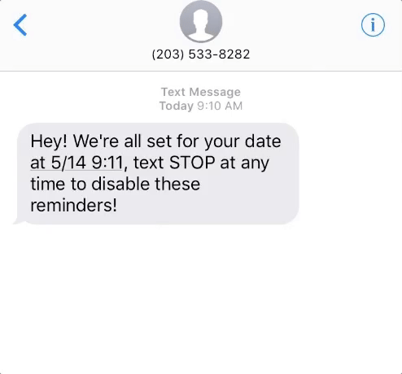

# Escape The Date!

A submission for [Disrupt NYC 2017](https://disruptny2017.devpost.com/) by @kr3110, @robertkng, @icancode007, @vorpus.

*MongoDB + ExpressJS + Node.js + React* + **[Nexmo](https://www.nexmo.com/)**

A dead-man's switch for first dates.

**Escape The Date!** checks in with you every once in a while through SMS or voice call to make sure everything's going great. If we don't get a response after a while, Escape The Date will get in touch with your SOS contact so your friend can check up on you.

